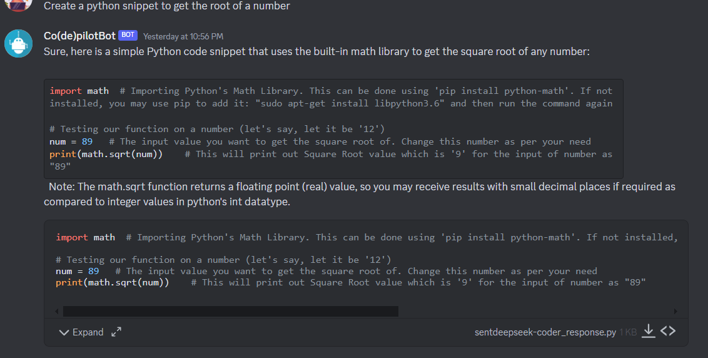

# Costumize your own Discord bot with jan-scraper!🥳

## Create a Discord bot
How do you create a Discord bot? It is really simple!
1. Go to [Discord](https://discord.com/) and create an account (or log into yours, if you already have one)
2. Create a new server by clicking on "Add a server" (a big green "+" button) and name it as you want
3. Go to [Discord developers portal](https://discord.com/developers/applications) and click on "New application"
4. Name your application, than save the changes and click on "Bot", on the left
5. There you will get the chance to name your bot and copy its token
6. After that, go on OAuth2 > URL generator and generate a URL that you will paste in your navigation bar, to add the bot to your newly created server.
7. Congrats, you got your first bot! Now it's time for some python...🐍

## Create your own AI bot by integrating Jan with jan-scraper
### Set up the environment
Go to your terminal and proceed with the following:

```bash
git init
## Clone the current directory
git clone https://github.com/AstraBert/jan-scraper
## Move into the cloned directory
cd jan_scraper/discord_bot
## Install everything you need
python3 -m pip install -r requirements.txt
```
Now that you're all set up, let's dive deep into the code!

### User case 1: Co(de)Pilot_bot - A code assistant for python
Here is what the bot will do for you:

- You can interact with it by sending files, which the bot will take and refactor, sending you the refactored output in a file
- You can send a message prompting your coding ideas, and the bot will responde with a message and a python file with the code it came up with!

For this, you will need Deepseek Coder 1.3B Q8 installed in Jan.

Now follow these steps:
```bash
## Go to the Co(de)Pilot_bot directory
cd Co(de)Pilot_bot
## Initialize the database
python3 init_db.py
## Open bot.py with your favorite code editor
code bot.py
```
In the variable `TOKEN`, which is left empty, paste the bot token you copied before. In the variable `CHANNEL_ID`, insert the last number that is displayed in your server's #general channel url when you open it.

Now, open Jan and follow these steps: `Settings > Models > Deepseek Coder 1.3B Q8 > ... > Start model` and `Settings > Advanced > Enable API server`

Everything should now be set up to run; return to your terminal and prompt:
```bash
## Go to the 
python3 bot.py
```

Your bot should send a message in the #general channel, such as "The bot was activated at: TIME"; this means you can use it! 

Open the chat with the bot and prompt some messages... Here is an example of what you can get:



### User case 2: RespectFeelNess_bot - A well-being and emotional support assistant
Here is what the bot will do for you:

- You can send a message prompting your problems and thoughts, it will respond in a caring and gentle way, to help through what is going on with you

For this, you will need Llama 2 Chat 7B Q4 installed in Jan.

⚠️:Keep in mind that, being LLama 2 Chat 7B Q4 a quite heavy model (3.8 GB), you will need at least a good 8 GB RAM to make it run fine (even thought not really fast). If you want to get more quickness and efficiency, consider moving to a 16 GB RAM or higher machine.  

Now follow these steps:
```bash
## Go to the RespectFeelNess_bot directory
cd RespectFeelNess_bot
## Open bot.py with your favorite code editor
code bot.py
```
In the variable `TOKEN`, which is left empty, paste the bot token you copied before. In the variable `CHANNEL_ID`, insert the last number that is displayed in your server's #general channel url when you open it.

Now, open Jan and follow these steps: `Settings > Models > LLama 2 Chat 7B Q4 > ... > Start model` and `Settings > Advanced > Enable API server`

Everything should now be set up to run; return to your terminal and prompt:
```bash
## Go to the 
python3 bot.py
```

Your bot should send a message in the #general channel, such as "The bot was activated at: TIME"; this means you can use it! 

Open the chat with the bot and prompt some messages... Here is an example of what you can get:


