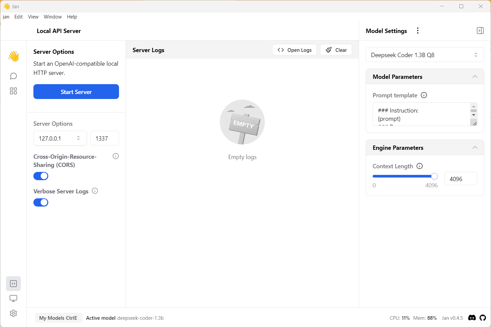
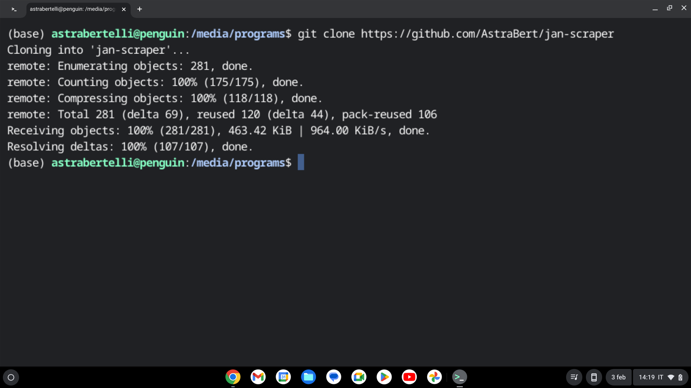
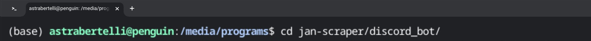
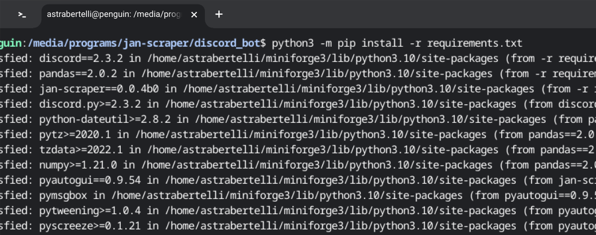
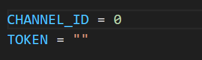
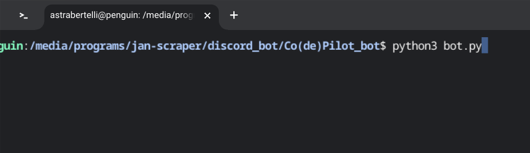
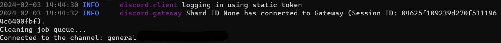

<h2 align="center">So... Are you not that familiar with python, command line and stuff? No problem!🥳</h2>
<h2 align="center">The following page will give you a</h2>
<h1 align="center">HANDS-ON TUTORIAL</h1>
<h3 align="center">So that, if you never coded in python, you can still create your bot!!!🥰</h3>

For this tutorial, we will use Co(de)Pilot_bot as an example!

**1. Activate Jan API server**

**2. Go to your terminal and clone `jan-scraper` directory with `git clone`**

**3. Go to the cloned directory and then to the discord bot directory**

**4. Once you're there, install all required dependencies with `python3 -m pip install -r requirements.txt`**

**5. When you're done, go to the Co(de)pilot_bot directory**

**6. Be sure to modify `TOKEN` and `CHANNEL_ID` variables as per your needs**

**7. Now that you're all set up, run the following command:**

**8. You should see something like this, after a while:**

Everything should now work! Go on Discord and open the **direct messages** with your bot: you will now be able to chat!!!😁
